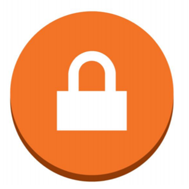
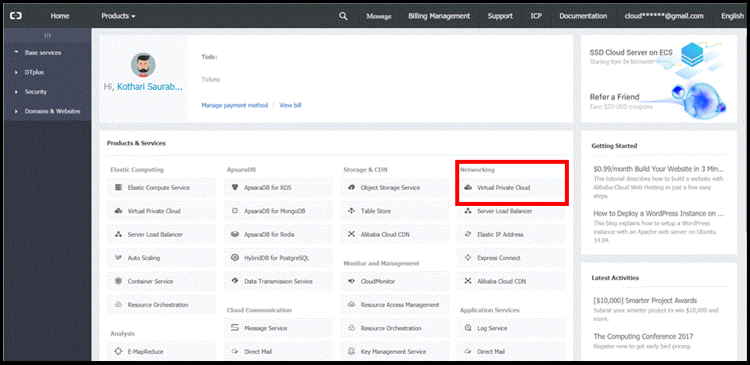

TEST 

Test Subtitle

 

 

Table of Contents

Introduction. 3

Topology. 4

Preparation. 5

Configuration - Alibaba Cloud. 7

Configuration - Google Cloud. 21

Configuration - Verification. 29

 

 

Introduction

This guide walks you through the process of configuring the Alibaba Virtual Private Cloud (VPC) Network Gateway (also referred to as the VRouter within the Alibaba console) for integration with the [Google Cloud VPN service](https://cloud.google.com/compute/docs/vpn/). This information is provided as an example only.  If utilizing this guidance to configure your Alibaba Cloud implementation, be sure to substitute the correct IP information for your environment. Also note, this guide is not meant to be a comprehensive overview of IPsec and assumes users have a basic familiarity with the IPsec protocol.

Screenshot example

